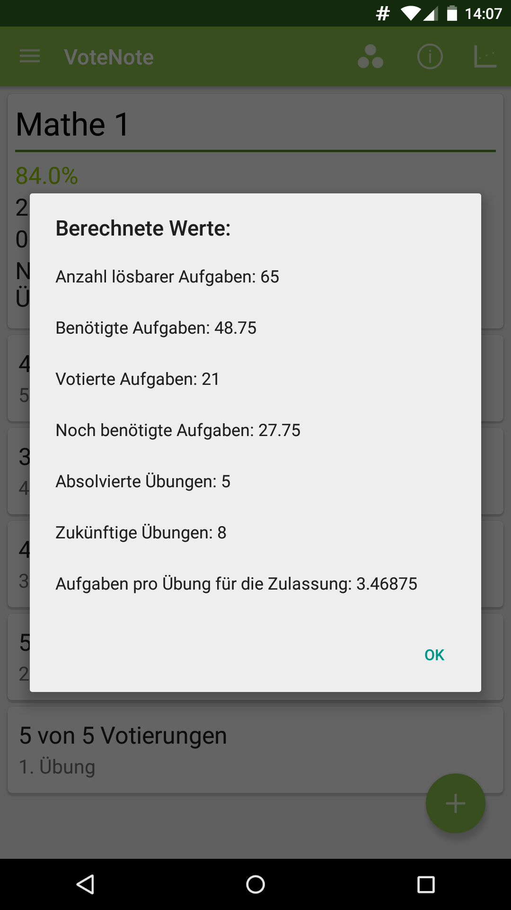

  

# VoteNote
VoteNote helps you to stay on top of your votes on university exercises. Whether you still need to do assignments or achieve some presentation points, Votenote shows you all important parameters concerning your exercises. Ultimately, you will never again miss the exam admission bar with this app!

## Data Analysis
Overview             |  Detailed Information
:-------------------------:|:-------------------------:
 |  

The analysis of your data includes:
* the percentage of assignments you solved so far
* how many assignments per exercise you still need to do to get approved for the exam

You can also view the differences in your contribution between the subjects on a graph.

## Subject Management

You can have multiple subjects, and every one of them can have multiple assignment counters and assignment presentation counters, in case you need to present your solutions for admission.

## Permissions
The permissions are needed to write and read backups from your sd card.

## PlayStore
The app is available at [https://play.google.com/store/apps/details?id=de.oerntec.votenote](https://play.google.com/store/apps/details?id=de.oerntec.votenote).

